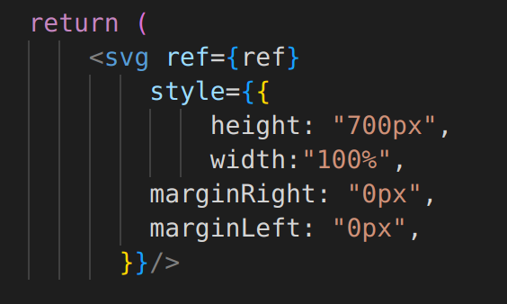
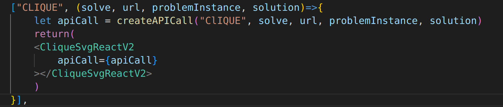

## Branching Routines
The primary branch of the repository used for production is ReduxAPI_GUI. Additions to this branch should only be made through the merging of the develop branch after a code review from a different developer whenever possible. Currently, most code additions are made directly to the develop branch and we have had little issue with merge conflicts. As more people begin adding to the code base, it may make more sense to branch off of the develop branch. Once a task is finished merge your own code into the develop branch. To do so create a pull request, and assign a reviewer. The person who completes the code review will then complete the pull request.

## Adding to the code base
### Visualizations
All visualizations are built on the front end. New visualizations should be added to the components/Visualization/svgs folder. These files should include in some way a function that can be called as a react component, and returns an svg as seen below.

Current best practice is that these functions take only a url for an api call, which returns information specific to the visualization. Because each visualization is specialized, the way the svg is generated is up to the developer working on the problem, although they should follow the style of current visualizations, and reuse methods for similar visualizations where ever possible. 

Once a new visualization is finished, it can be added to the GUI by adding the react component to Maps in either Visualizations.js, or ReducedVisualizations.js. For generic visualizations, the problem name should map to a function which returns the react component. For reduction visualizations, the reduction name should map to a function which returns the react component.

## Definiton of Done
### Visualization
All added visualizations should fulfill the following requirements, 

- Visualization function is a react component, which returns an svg
- React component takes api call as a parameter
- API endpoint specific to visualization for both solved, and unsolved variations are functional, and documented correctly
- Solution and gadget highlighting are functional for both general problem, and all reduction visualizations
- React component is added to correct visualization map