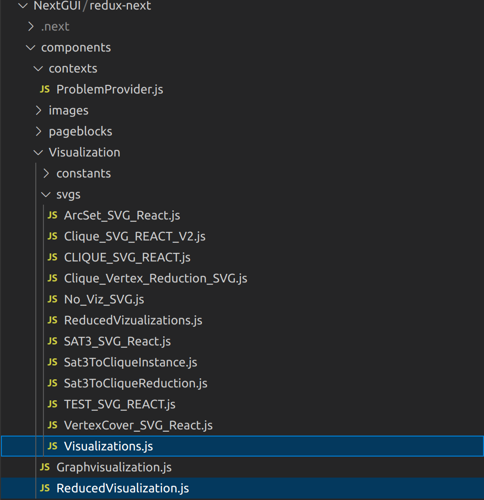

The front end of Redux is currently functionally complete. The majority of additions will be visualizations. Pertinent files for doing so are components/Visualization/svgs/Visualizations.js and components/Visualization/svgs/ReducedVisualizations.js.

Any new major components should be added to the components/pageblocks folder, and then implemented into the index.js file.

Other important folders include components/Visualization/svgs, which holds all react components which return svgs, and components/widgets, which contains additional general use react components.