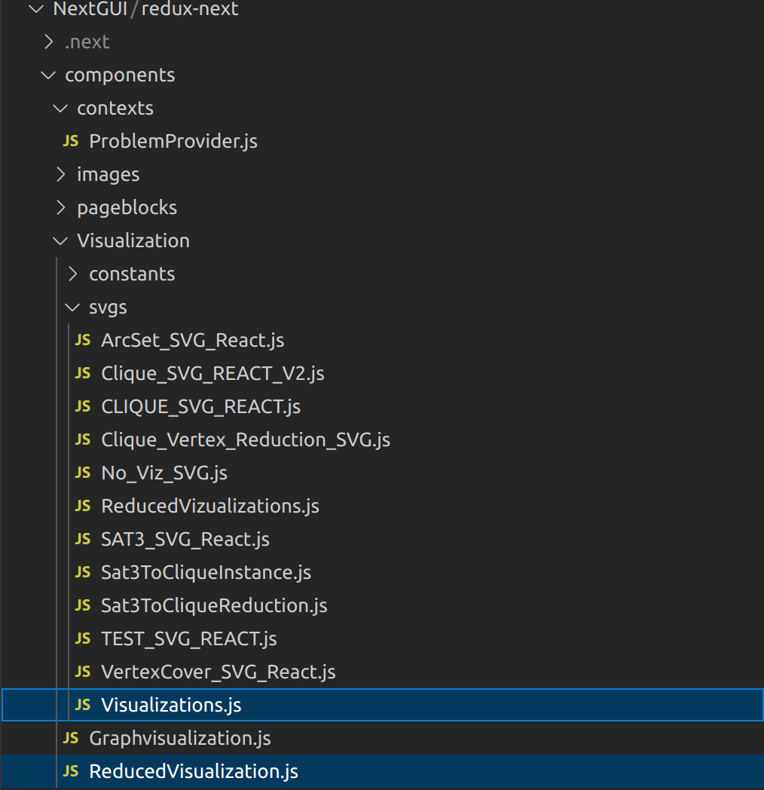
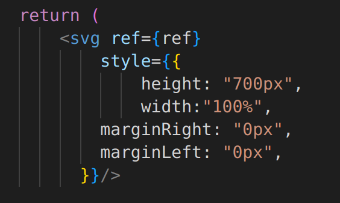
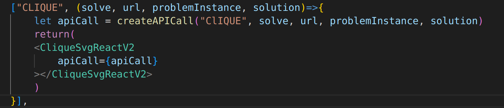

# Redux Frontend (GUI)

**Interactive web interface for the Redux computational complexity knowledgebase**

[](https://www.isu.edu/cs/)

##  Live Demo
- **Website**: [https://redux.portneuf.cose.isu.edu/](https://redux.portneuf.cose.isu.edu/)
- **Backend Repository**: [Redux Backend](https://github.com/ReduxISU/Redux)

##  Table of Contents
- [About Redux Frontend](#about-redux-frontend)
- [Prerequisites](#prerequisites)
- [Local Development Setup](#local-development-setup)
- [Code Overview](#code-overview)
- [Adding to the Codebase](#adding-to-the-codebase)
- [Deployment](#deployment)
- [Branching Strategy](#branching-strategy)
- [Definition of Done](#definition-of-done)
- [Contributors](#contributors)
- [Additional Resources](#additional-resources)

---

## About Redux Frontend

The Redux Frontend is a Next.js-based web application that provides an interactive interface for exploring computational complexity problems, reductions, and visualizations. The frontend is **integrally linked to the Redux REST API** and depends on the backend being installed and running.

**Key Features:**
- Interactive problem visualization using React and D3.js
- Real-time problem reduction visualization
- Solution and certificate verification interface
- Gadget highlighting for reduction mappings
- SVG-based rendering for mathematical structures

---

## Prerequisites

Before you begin, ensure you have the following installed:

- [Node.js](https://nodejs.org/en/download) (with npm)
- [Redux Backend](https://github.com/ReduxISU/Redux) (must be running)

---

## Local Development Setup

### Step 1: Clone the Repository

```bash
git clone https://github.com/ReduxISU/Redux_GUI.git
cd Redux_GUI
```

### Step 2: Install Dependencies

```bash
npm install
```

### Step 3: Ensure Backend is Running

The Redux GUI requires the Redux API to be running. If you need to work on both the frontend and backend simultaneously:

1. Clone the Redux API repository
2. Launch the Redux API using `dotnet run`
3. The API will be available at `http://127.0.0.1:27000/`

### Step 4: Start Development Server

```bash
npm run dev
```
## Code Overview

The Redux frontend is currently functionally complete. The majority of future additions will be **visualizations**.



### Key Directory Structure

**Visualization Files:**
- `components/Visualization/svgs/Visualizations.js` - Maps problem names to visualization components
- `components/Visualization/svgs/ReducedVisualizations.js` - Maps reduction names to visualization components  
- `components/Visualization/svgs/` - Contains all SVG-generating React components

**Page Components:**
- `components/pageblocks/` - Major components that make up the main interface
- `pages/index.js` - Main page that implements all components

**Widgets:**
- `components/widgets/` - Reusable React components used throughout the application

### Adding New Components

When adding new features:
- **New major components** → Add to `components/pageblocks/` folder, then implement in `pages/index.js`
- **New visualizations** → Add to `components/Visualization/svgs/` folder
- **New widgets** → Add to `components/widgets/` folder
---

## Adding to the Codebase

### Adding New Visualizations

All visualizations are built on the frontend. Follow these steps to add a new visualization:

#### 1. Create the Visualization Component

Add your visualization to the `components/Visualization/svgs/` folder.

**Requirements:**
- Must be a React component function
- Must return an SVG element
- Should take only a URL for an API call as a parameter

**Example structure:**



Current best practice is that these functions take only a URL for an API call, which returns information specific to the visualization. Because each visualization is specialized, the way the SVG is generated is up to the developer working on the problem, although they should follow the style of current visualizations and reuse methods for similar visualizations wherever possible.

#### 2. Follow Best Practices

- The API URL should return information specific to your visualization
- Follow the style of existing visualizations
- Reuse methods for similar visualizations wherever possible
- Ensure the visualization works for both solved and unsolved problem instances

#### 3. Register the Visualization

Once your visualization is complete, add it to the appropriate map:



**For general problem visualizations:**
- Open `components/Visualization/svgs/Visualizations.js`
- Add your component to the map with the problem name as the key

**For reduction visualizations:**
- Open `components/Visualization/svgs/ReducedVisualizations.js`
- Add your component to the map with the reduction name as the key

**Example:**
```javascript
const visualizationMap = {
  "My Problem Name": (props) => <MyProblemVisualization {...props} />,
  // ... other visualizations
};
```

### Adding New Major Components

New major page components should be:
1. Created in the `components/pageblocks/` folder
2. Implemented in the `pages/index.js` file

### Adding New Widgets

General-purpose React components should be added to the `components/widgets/` folder.

---

## Deployment

### Production Deployment with npm

To deploy the application in production mode:

```bash
npm install
npm run build
npm start
```

This will:
- Install all dependencies
- Build a production-optimized version
- Start a production server on port 3000

### Docker Deployment

Alternatively, deploy using Docker:

```bash
npm run build
docker build -t reduxgui .
docker run -it --rm -p 3000:3000 --name reduxgui reduxgui
```

**Note:** The Docker server uses production binaries, so warnings will be different from the development environment.

### CI and publishing

`.github/workflows/rbs.yml` runs the whole pipeline through the
[Redux Build System](https://github.com/ReduxISU/Redux_Build_System) inside this repo's dev
container: `audit → format-check → lint → build → integration-test → push`. Gates and thresholds
live in `rbs.toml`, and the same command runs locally:

```bash
rbs ci
```

On a push to `ReduxAPI_GUI`, and only if every gate passed, `push` publishes the exact image the
integration tests ran against to `ghcr.io/reduxisu/redux_gui` as `:<sha7>` and `:latest`. On pull
requests it reports `skipped`. See [TESTING.md](TESTING.md) for the integration suite.

---

## Branching Strategy

### Production Branch
- **Branch name:** `ReduxAPI_GUI`
- Additions should **only** be made through merging from the `develop` branch
- Requires code review before merging

### Development Branch
- **Branch name:** `develop`
- Most code additions are made directly here
- Relatively few merge conflicts

### Workflow

1. **Make changes** on the `develop` branch (or create a feature branch from `develop`)
2. **Create a pull request** to merge into `develop`
3. **Assign a reviewer** for code review
4. **Reviewer completes** the pull request after approval
5. **Periodically merge** `develop` into `ReduxAPI_GUI` for production deployment

** Important:** The person who completes the code review is responsible for completing the pull request.

---

## Definition of Done

### New Visualizations

All added visualizations must fulfill the following requirements:

 **React Component Structure**
- Visualization function is a React component that returns an SVG
- Component takes an API call URL as a parameter

 **API Integration**
- API endpoint specific to the visualization is functional
- Both solved and unsolved variations have working endpoints
- Endpoints are documented correctly in the backend

 **Feature Completeness**
- Solution highlighting is functional for general problem visualization
- Gadget highlighting is functional for reduction visualizations
- Works for all relevant reduction types

 **Code Integration**
- React component is added to the correct visualization map
- Component follows the style of existing visualizations
- Reuses methods from similar visualizations where applicable

---

## Contributors

This project is developed by students and faculty at Idaho State University's Computer Science Department.

For a complete list of contributors, visit our [About Us page](https://redux.portneuf.cose.isu.edu/aboutus).

---

## Additional Resources

### Documentation
- [Redux Backend Repository](https://github.com/ReduxISU/Redux)
- [Redux Backend API Documentation](https://api.redux.portneuf.cose.isu.edu/swagger/index.html)
- [Wikipedia: What is NP-Complete?](https://en.wikipedia.org/wiki/NP-completeness)
- [Karp's 21 NP-Complete Problems](https://en.wikipedia.org/wiki/Karp%27s_21_NP-complete_problems)

### Technology Stack
- **Framework:** Next.js (React)
- **Visualization:** D3.js, SVG
- **Styling:** CSS/Styled Components
- **API Communication:** REST API calls to Redux Backend

### Related Repositories
- **Backend API:** [Redux](https://github.com/ReduxISU/Redux)
- **Quantum Solver:** [quantumsolver](https://github.com/ReduxISU/quantumsolver)

---

## Getting Help

- **Issues:** Use GitHub Issues for bug reports and feature requests
- **Discord:** [Join our community](https://discord.gg/sEC3rTXn2Z)
- **Weekly Meetings:** Thursdays at 11:20 AM MT via [Zoom](https://isu.zoom.us/j/85203480771?pwd=oEMlnn5EItmPFy3OKHnLqENQF52OIK.1&jst=3)

---

## License

This project is developed at Idaho State University's Computer Science Department.

---


